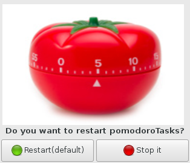
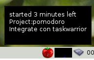
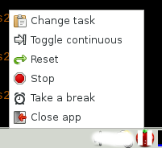
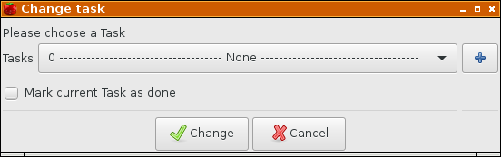

Don't make any excuse anymore to not use the [Pomodoro Technique](https://en.wikipedia.org/wiki/Pomodoro_Technique)!

###Info

Pomodoro technique allows you to concentrate on the current task and take short breaks meanwhile works.
If you get that and join it with a task manager alike taskwarrior (or any other) you can have a complete workflow, accounting the time spend on any task meanwhile you take the proper rests for your brain, body, life and eyes. :)

A "week" hack project.

###Dependencies (python)

1. pip install tasklib --user

###Why yet another pomodoro app?

There isn't anything with taskwarrior alike for linux AFAIK.  :o:

###Screenshots

Relax time:

Back to work:

Trayicon:

###Install 

The typical workflow is start the daemon once log in (systemd,openbox autostart, bash_profile ...) and 
then control it with the simple trayicon app.

There is included a simple client cli tool too.

###Spec

Boilerplate implementation of the pomodoro technique with a python-dbus written client/server architecture.

Minimalistic implementation with FSM (Finite State Machine) and some dbus niceness. :)

###TODO

- [x] dbus 
- [x] Unit testing
- [ ] \(99% done\) Timewarrior integration to track the complete lifespan of your computer. ;)
- [ ] Dont wait a minute to refresh the trayicon when used the cli

###FIXED

1. ~~nothing for now~~
